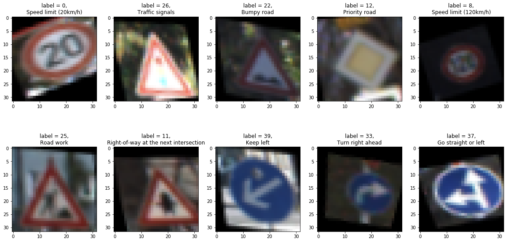
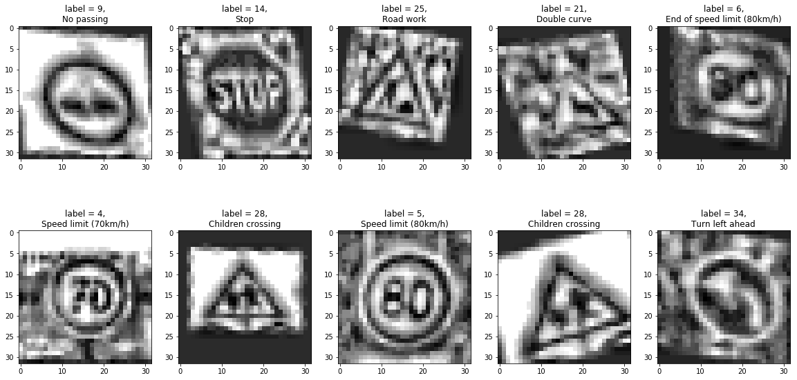
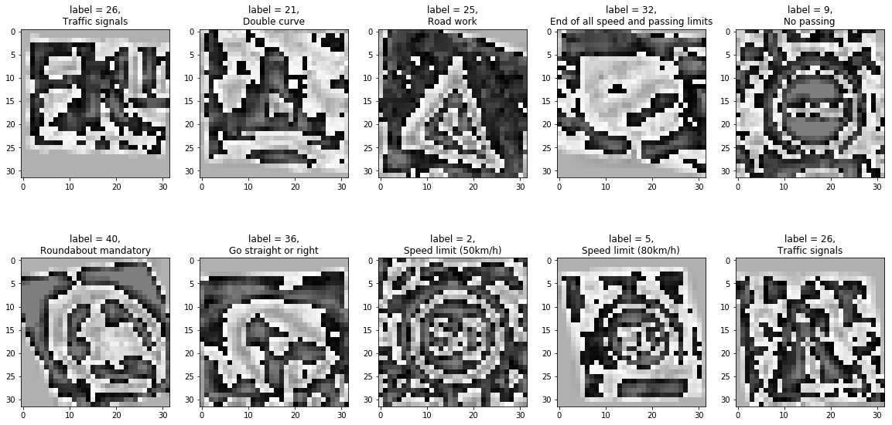
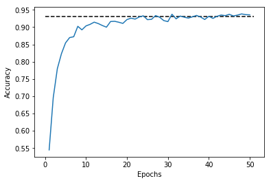
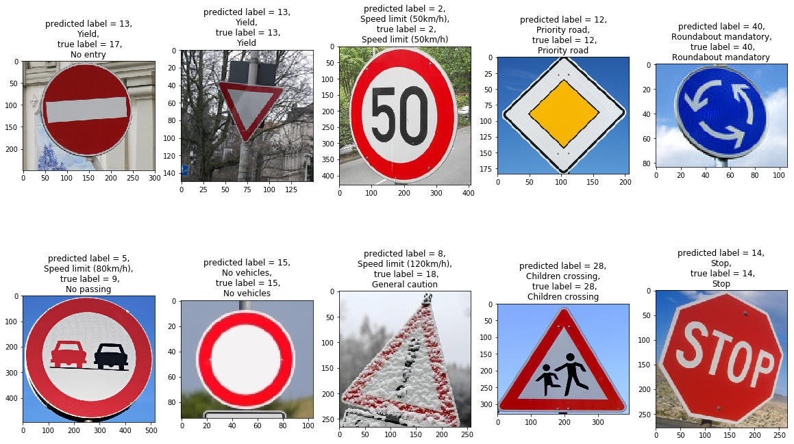

# **Traffic Sign Recognition** 

### The goal of this project is to define a convolutional neural network (CNN) and train it on images of German traffic signs. This  was done as an assignment for Udacity's Self-driving car engineer Nanodegree program.

---

### Data Set Summary & Exploration

For the project we got a training data set of 34 799 images, a validation data set of 4 410 images and a test data set of 12 630 images. The size of the images was 32x32x3 and there are 43 different classes of traffic signs in the data sets.

It however turned out that generating additional training data would greatly benefit the accuracy of the model, so we generated additional images from the images in the training data set such that we would have 172 000 images in total. The additional images where generated by doing a random affine transformation, by up- or downscaling by a random factor and by rotating by a random angle around the center of the image.

An example of ten images of the extended training data set can be seen here:

<figure class="image">
	
	<figcaption>Examples of images from extended training data set</figcaption>
</figure>

### Design and Test a Model Architecture

#### Preprocessing data
The images were preprocessed as follows before feeding them to the neural network:

1. Transform to YCrCb color space. This allows us to use the gray scale Y-channel image seperately from the Cr and Cb channels.
2. Do histogram equalization (using CLAHE algorithm) on the Y-channel to increase the contrast.
3. Normalize the data so that it has mean zero and equal variance.

<figure class="image">
	
	<figcaption>Examples y-channel images after histogram equalization</figcaption>
</figure>

<figure class="image">
	
	<figcaption>Examples y-channel images after normalization </figcaption>
</figure>

#### Model architecture

The architecture used in this model is based on the LeNet5 architecture ([http://yann.lecun.com/exdb/lenet/]()). In order to increase accuracy I made the following adaptions:

- Increase the number of features in the convolutional layers from 6 resp. 16 to 108 resp. 100. In the first layer 100 features are connected to the Y channel and 8 features are connected to the CrCb channels. (This idea was taken from [http://yann.lecun.com/exdb/publis/pdf/sermanet-ijcnn-11.pdf]()). 
- Use maximum pooling instead of subsampling.
- Add a drop out with keep probability 0.7 after the first and second fully connected layer.
- Adapt the output dimension of the last layer to the number of classes in the training data set.

In total, we have the following architecture:

 <table style="width:100%">
  <tr>
    <th>Layer</th>
    <th>Type</th>
    <th> Input dimensions</th>
    <th> Output dimensions</th>
  </tr>
  <tr>
    <td>1</td>
    <td>Convolutional</td>
    <td>32x32x1(2)</td>
    <td>28x28x100(8)</td>
  </tr>
  <tr>
    <td></td>
    <td>Stacking</td>
    <td>28x28x100 + 28x28x8</td>
    <td>28x28x108</td>
  </tr>
  <tr>
    <td></td>
    <td>Activation (ReLu)</td>
    <td>28x28x108</td>
    <td>28x28x108</td>
  </tr>
  <tr>
    <td></td>
    <td>Pooling</td>
    <td>28x28x108</td>
    <td>14x14x108</td>
  </tr>
  <tr>
    <td>2</td>
    <td>Convolutional</td>
    <td>14x14x108</td>
    <td>10x10x100</td>
  </tr>
  <tr>
    <td></td>
    <td>Activation (ReLu)</td>
    <td>10x10x100</td>
    <td>10x10x100</td>
  </tr>
  <tr>
    <td></td>
    <td>Pooling</td>
    <td>10x10x100</td>
    <td>5x5x100</td>
  </tr>
  <tr>
    <td></td>
    <td>Flattening</td>
    <td>5x5x100</td>
    <td>2500</td>
  </tr>
  <tr>
    <td>3</td>
    <td>Fully connected</td>
    <td>2500</td>
    <td>120</td>
  </tr>
  <tr>
    <td></td>
    <td>Activation (ReLu)</td>
    <td>120</td>
    <td>120</td>
  </tr>
  <tr>
    <td></td>
    <td>Dropout</td>
    <td>120</td>
    <td>120</td>
  </tr>
  <tr>
    <td>4</td>
    <td>Fully connected</td>
    <td>120</td>
    <td>84</td>
  </tr>
  <tr>
    <td></td>
    <td>Activation (ReLu)</td>
    <td>84</td>
    <td>84</td>
  </tr>
  <tr>
    <td></td>
    <td>Dropout</td>
    <td>84</td>
    <td>84</td>
  </tr>
  <tr>
    <td>5</td>
    <td>Fully connected</td>
    <td>84</td>
    <td>43</td>
  </tr>
</table> 

In the paper [http://yann.lecun.com/exdb/publis/pdf/sermanet-ijcnn-11.pdf](), the authors mention that feeding the output of the first convolutional layer directly to the classifier (fully connected layers) alongside the output from the second convolutional layer improves accuracy. This seems logical as it allows the classifier to use low-level features (from the first CNN layer) as well as high-level features (from the second CNN layer). I implemented this idea but could not observe any increase in accuracy, so I decided to drop it.
 

#### Training the model

The model was training with a batch size of 128 and 50 epochs. We started with a learning rate of 0.001 and then decayed the learning rate with a Drop-Based Learning Rate Schedule (see here: [https://machinelearningmastery.com/using-learning-rate-schedules-deep-learning-models-python-keras/]()). An accuracy of 93.6% on the validation set was reached:
<figure class="image">
	
	<figcaption>Accuracies of the model on the validation set with respect to training epoch;</figcaption>
</figure>

 

### Test the Model on New Images

The model was then tested on ten additional images of German traffic signs found on the internet.

<figure class="image">
	
	<figcaption>Examples of German traffic signs with predicted and true label</figcaption>
</figure>

### Visualizing the Neural Network

